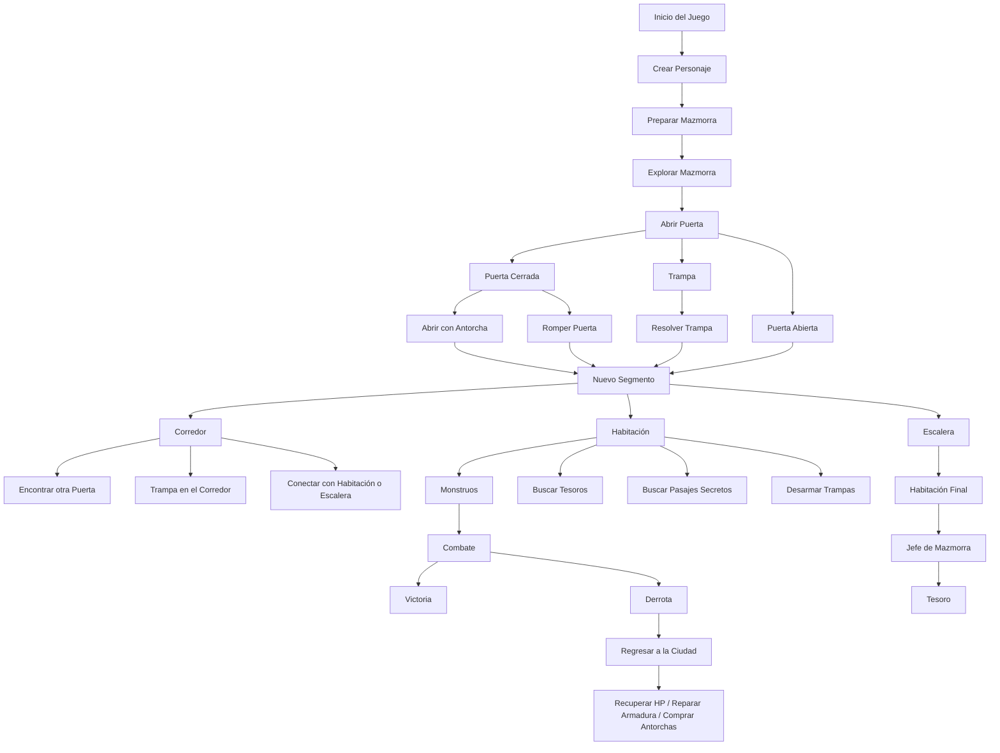
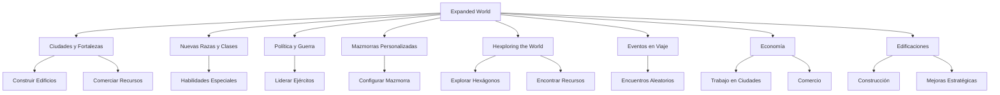

# Diagrama de Flujo: Guía Resumida de NoteQuest



### Inicio del Juego
1. **Crear Personaje**
   - Tirar 2d6 para determinar:
     - **Raza** (Tablas del libro, ejemplo: Elfo, Humano).
     - **Clase** (Tablas del libro, ejemplo: Guerrero, Cocinero).
   - Asignar HP, habilidades iniciales y armas según las tablas.
   - Equiparse con:
     - 10 antorchas.
     - Sin monedas inicialmente.

2. **Preparar Mazmorra**
   - Generar el **nombre de la mazmorra** (Tirar dados según tabla).
   - Crear el primer **segmento** (puertas, pasillos, habitaciones).

---

### Flujo de Exploración
#### Abrir Puertas
- **Tirar 1d6** para determinar qué ocurre:
  - 1: **Trampa** (consultar tabla de trampas).
  - 2-3: **Puerta cerrada** (opciones: abrir con antorcha, romper).
  - 4-6: **Puerta abierta** (procede al siguiente segmento).

#### Tipos de Segmentos
1. **Corredor:** Puede tener otras puertas conectadas, trampas o conexiones a otros segmentos.
2. **Habitación:** Contenido variable (tesoros, trampas, monstruos).
3. **Escalera:** Conduce a otro nivel.

---

### Acciones Dentro de la Mazmorra
1. **Moverse a un segmento:**
   - Si hay monstruos:
     - Iniciar **combate** (ver sección de combate).
   - Si no hay monstruos:
     - Opciones:
       - Abrir cofres.
       - Buscar pasajes secretos (gasta 1 antorcha).
       - Desarmar trampas (gasta 1 antorcha).

2. **Consumir Antorchas:**
   - Gastar 1 antorcha al abrir una puerta o realizar una acción especial.
   - Si las antorchas se agotan, el personaje muere (devorado por la oscuridad).

3. **Regresar a la Ciudad:**
   - Acciones disponibles:
     - Recuperar HP (1 moneda).
     - Reparar armadura (1 moneda).
     - Comprar antorchas (1 moneda cada una; máx. 10).

---

### Combate
1. **Inicio del Combate:**
   - Determinar quién ataca primero (silencio vs trampa).
   - Alternar turnos entre jugador y monstruos.

2. **Ataque:**
   - Tirar daño del arma (ver tabla de armas).
   - Reducir HP del enemigo. Si llega a 0, enemigo derrotado.
   - **Nota:** Algunos monstruos tienen habilidades especiales (ver tabla de monstruos).

3. **Derrota:**
   - Si el HP del personaje llega a 0:
     - Muere y deja su equipo en el lugar.
     - Crear un nuevo personaje para intentar recuperarlo.

---

### Expanded World
#### Nuevas Opciones
1. **Explorar Ciudades y Fortalezas:**
   - Interactuar con NPCs para obtener recursos.
   - Construir edificios o mejorar habilidades.

2. **Nuevas Razas y Clases:**
   - Acceso a razas avanzadas como Dragones o Slimes.
   - Clases especializadas con habilidades únicas.

3. **Política y Guerra:**
   - Gestionar reinos, liderar ejércitos y expandir territorios.

4. **Mazmorras Personalizadas:**
   - Crear y explorar mazmorras con configuraciones únicas.

5. **Hexploring the World:**
   - Explorar hexágonos en un mapa más grande.
   - Encontrar eventos aleatorios (ver tabla de eventos).
   - Recursos clave:
     - Comida, agua, antorchas.
     - Enemigos y aliados potenciales.

6. **Eventos en Viaje (Events on Travel):**
   - Encuentros al moverse entre ciudades y mazmorras.
     - Emboscadas.
     - Comerciantes.
     - Exploradores.

7. **Economía (Getting Money):**
   - Trabajo en ciudades:
     - Escoltar caravanas.
     - Cazar recompensas.
   - Comercio de bienes.
   - Saqueo de enemigos.

8. **Edificaciones (Buildings):**
   - Construcción en ciudades:
     - Posadas.
     - Talleres.
     - Fuertes.
   - Mejoras que otorgan ventajas estratégicas y económicas.



### Tabla de Afinidades
```plaintext
TABLE: AFFINITY
1. Raza A tiene ventaja sobre Raza B
2. Clase X tiene desventaja contra Clase Y
3. Elemento Fuego > Planta > Agua > Fuego
```

Este esquema organiza tanto las mecánicas básicas como las opciones avanzadas del mundo expandido de NoteQuest. Puedes usar ambos diagramas para abarcar todas las posibilidades del juego.
