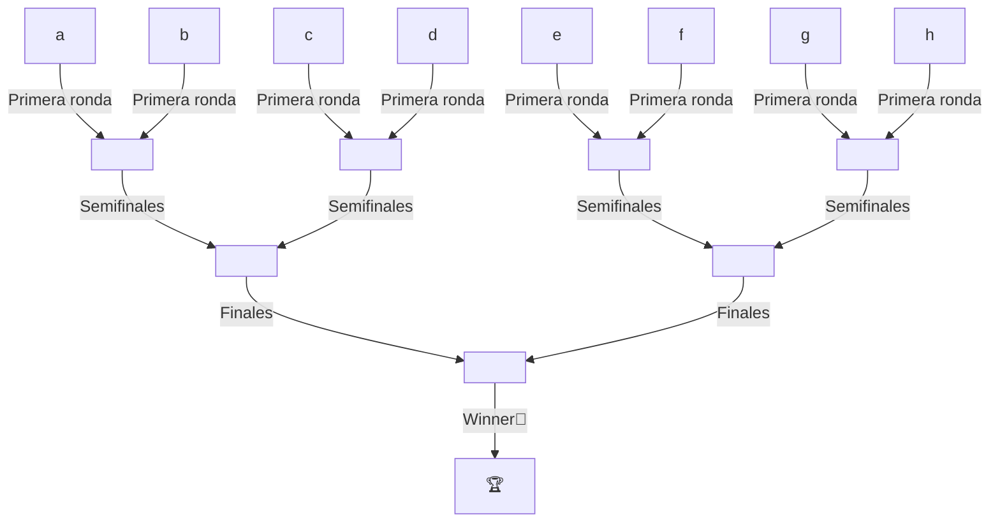
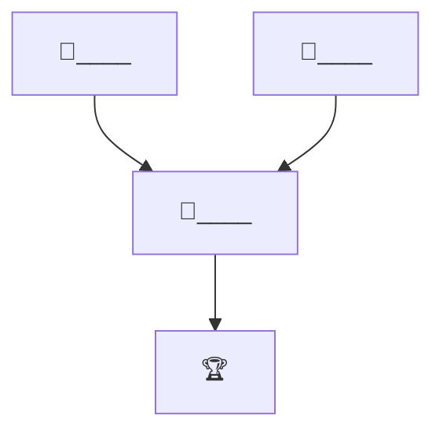

# TB 

```mermaid
graph TD;

    A[ a ]     --> | Primera ronda |A1[ ]
    B[ b ]    --> | Primera ronda |A1

    C[ c ]  --> | Primera ronda |B1[ ]
    D[ d ]    --> | Primera ronda |B1

    E[ e ]    --> | Primera ronda |C1[ ]
    F[ f ]    --> | Primera ronda |C1

    G[ g ]     --> | Primera ronda |D1[ ]
    H[ h ]   --> | Primera ronda |D1

    A1 --> |Semifinales|E1[ ]
    B1 --> |Semifinales|E1

    C1 --> |Semifinales|F1[ ]
    D1 --> |Semifinales|F1

    E1 --> |Finales|Y1[ ]
    F1 --> |Finales|Y1
    
    Y1[ ] --> |Winner🥇|Z1[ 🏆]

```

```mermaid
graph TD;
    A[🥈____] --> C1[ ]
    B[🥉____] --> C1
    
    C1[🥇____] --> Z1[ 🏆]

```
